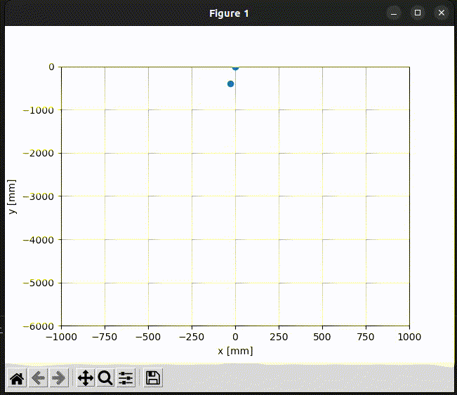

# HLK-LD2450

This is a simple Python implementation of the serial protocol and two demos of the [HLK-LD2450 24 GHz Radar Sensor](http://www.hlktech.net/index.php?id=1182). You can also try the app from HLK or the official PC demo. This code uses the serial port to communicate with the sensor.

## Prerequisites

You need the following hardware to run this demo:

- Linux PC (tested with Ubuntu 22.04, and Debian 12)
- HLK-LD2450 24 GHz Radar Sensor
- USB to TTL Adapter (3.3 V)
- A cable with a 1.5 mm (pitch) 4-pin connector to Dupont connectors

> Note: it should also work on Windows, granted you select the correct COM port (the installation will be a bit different).

### Wiring

Connect the sensor to the USB to TTL adapter:

| LD2450 | USB to TTL |
| ------ | ---------- |
| GND    | GND        |
| 5 V    | 5 V        |
| RX     | TX(D)      |
| TX     | RX(D)      |

> Note: while it is needed to provide 5 V to the sensor, the logic works with 3.3 V, not more. Also, the provided cable do not refer to any norm (i.e., the black wire is not necessarily the ground and the red is not necessarily the 5 V).

### Installation

Create a virtual environment and install the required packages:

```bash
# Create the environment (use python3 on older Linux systems or install python-is-python3)
python -m venv .venv

# Activate the environment (on Linux)
./.venv/bin/activate

# Activate the environment (on Windows)
./.venv/Scripts/activate.bat

# Install the requirements
pip install -r  requirements.txt
```

## Get started

`print_targets.py` prints out the received data from the sensor (x, y, speed, distance resolution) of three targets:

```bash
sudo python print_targets.py -p /dev/ttyUSB0
```


`plot_targets.py` plots the received data from the sensor (x, y) of three targets:

```bash
sudo python plot_targets.py -p /dev/ttyUSB0
```



## Troubleshooting

- Check that the USB to TTL adapter is connected to the correct port:

```bash
sudo dmesg | grep tty
```

## Notes and Disclaimer

- There seems to be some outliers in the data which are not filtered in this implementation.
